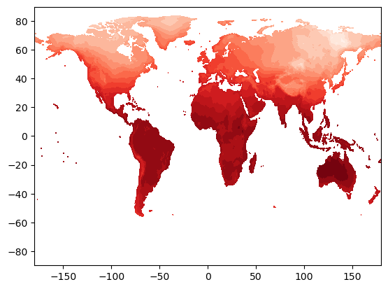
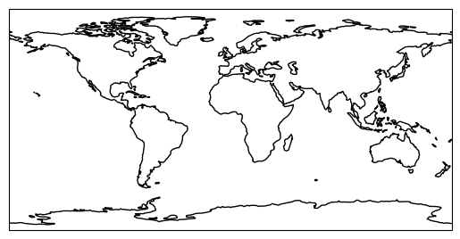
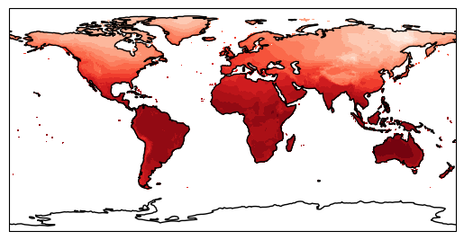
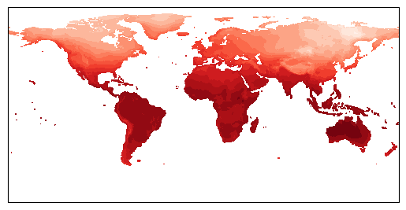
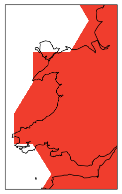
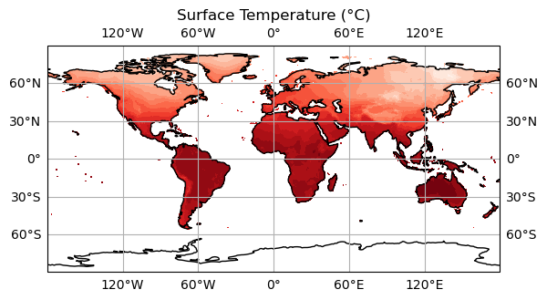
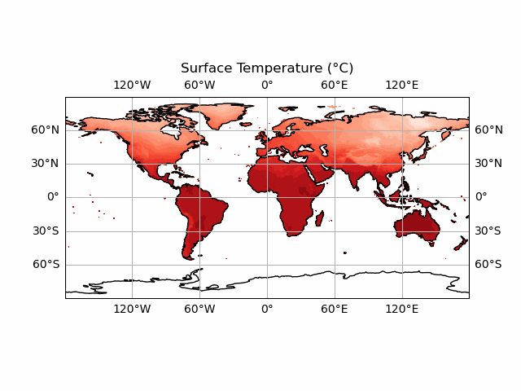
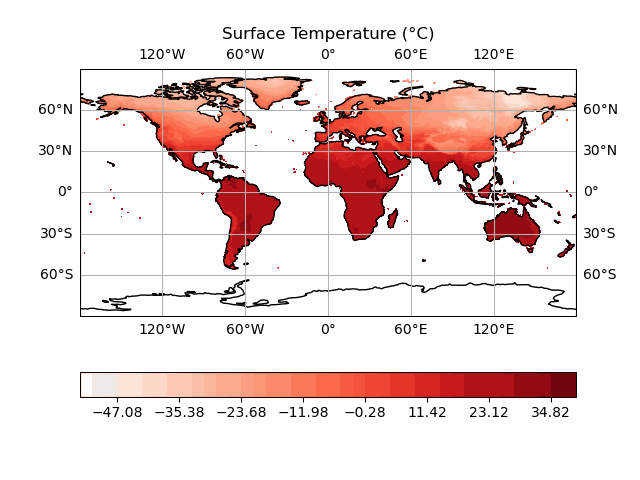
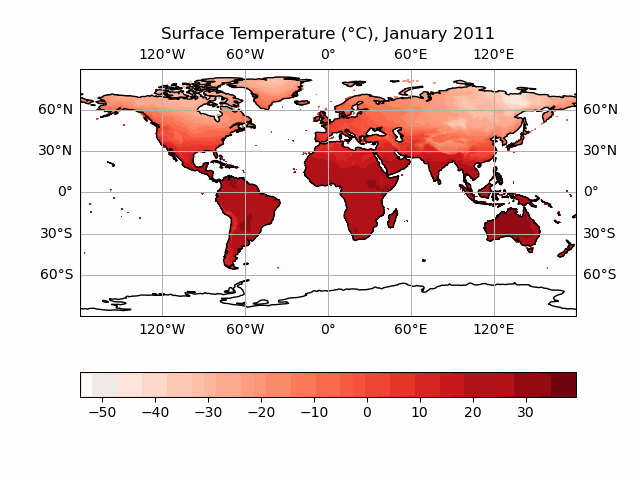

### NetCDF files

What about data stored in other types of files? Scientific data is often stored in
[NetCDF](https://en.wikipedia.org/wiki/NetCDF) files.

NetCDFs are nice! They are *self-describing* - i.e. they are set up to contain both the data required, and any metadata that helps the user understand that data. They are often used to store large 3 (or greater) dimensional matrices or tensors, making them ideal for storing data on e.g. the vertical and horizontal structure of the atmosphere over long timescales.

Data such as the [ERA5](https://www.ecmwf.int/en/forecasts/dataset/ecmwf-reanalysis-v5) climatological reanalysis are stored in netCDF - often with tens or hundreds of different atmospheric variables gridded at each temporal and spatial point. 

Such large datasets would be very unwieldy to work with in Numpy or even using Pandas, but netCDF has us covered. We will be looking a less complex dataset than this here - but the principles can be applied to using these datasets also.

Python has a library called ``netCDF4`` which is designed for operating with these files. 

We will here use data from the Climate Research Unit at the UEA, describing monthly-mean global surface temperature. 

> ## Using other libraries
>
> For the rest of this lesson, we need to use a python library that isn't included in the default
> installation of Anaconda. There are various ways to doing this, depending on how you opened the Jupyter Notebook:
>
> If you're using Anaconda Navigator:
> - return to the main window of Anaconda Navigator
> - select "Environments" from the left-hand menu, and then "**base** (root)"
> - Select the Not Installed filter option to list all packages that are available in the environment’s channels, but not installed.
> - Select the name of the package you want to install. We want `NetCDF4`
> - Click Apply
>
> If you opened the Jupyter Notebook via the command line:
> - you'll need to close the Notebook (Ctrl+C, twice)
> - run the command `conda install netcdf4`, and accept any prompt(s) (`y`)
{: .callout}

~~~
import netCDF4 as nc
~~~
{: .language-python}

We can then import a netCDF file, and check to see what python thinks its type is:

~~~
globaldata = nc.Dataset("cru_data.nc")
print(type(globaldata))
~~~
{: .language-python}

~~~
<class 'netCDF4._netCDF4.Dataset'>
~~~
{: .output}

We can look at what variables our netCDF contains by doing:

~~~
globaldata.variables.keys()
~~~
{: .language-python}

~~~
dict_keys(['lon', 'lat', 'time', 'tmp', 'stn'])
~~~
{: .output}

Here we can infer that we have three co-ordinates, longitude, latitude and time, and two variables 'tmp' and 'stn'. We can probably guess that 'tmp' is temperature, since we are looking at surface temperature data, but what is 'stn'? Let's check this out in more detail. We can do this using:

~~~
globaldata.variables['stn']
~~~
{: .language-python}

~~~
<class 'netCDF4._netCDF4.Variable'>
int32 stn(time, lat, lon)
    description: number of stations contributing to each datum
unlimited dimensions: time
current shape = (84, 360, 720)
filling on, default _FillValue of -2147483647 used
~~~
{: .output}

So we see that 'stn' is some extra data that is useful to understand the reliability of our temperature data. We can also see the shape of the data - ``(84, 360, 720)``. This gives us an indication of the co-ordinates - it is likely that 360 and 720 refer to latitude/longitude, which means we have 84 temporal points. Let's check using the ``.variables['var']`` syntax again:

~~~
globaldata.variables['time']
~~~
{: .language-python}

~~~
<class 'netCDF4._netCDF4.Variable'>
float32 time(time)
    long_name: time
    units: days since 1900-1-1
    calendar: gregorian
unlimited dimensions: time
current shape = (84,)
filling on, default _FillValue of 9.969209968386869e+36 used
~~~
{: .output}

Yes, this checks out. Our time array has a length of 84. But what does "days since 1900-1-1" mean for us? Let's have a look at the actual values in the dataset. We do this by adding a slice to what we put previously. Let's slice for all of the data in the array.

~~~
globaldata.variables['time'][:]
~~~
{: .language-python}

~~~
masked_array(data=[40557., 40587., 40616., 40647., 40677., 40708., 40738.,
                   40769., 40800., 40830., 40861., 40891., 40922., 40952.,
                   40982., 41013., 41043., 41074., 41104., 41135., 41166.,
                   41196., 41227., 41257., 41288., 41318., 41347., 41378.,
                   41408., 41439., 41469., 41500., 41531., 41561., 41592.,
                   41622., 41653., 41683., 41712., 41743., 41773., 41804.,
                   41834., 41865., 41896., 41926., 41957., 41987., 42018.,
                   42048., 42077., 42108., 42138., 42169., 42199., 42230.,
                   42261., 42291., 42322., 42352., 42383., 42413., 42443.,
                   42474., 42504., 42535., 42565., 42596., 42627., 42657.,
                   42688., 42718., 42749., 42779., 42808., 42839., 42869.,
                   42900., 42930., 42961., 42992., 43022., 43053., 43083.],
             mask=False,
       fill_value=1e+20,
            dtype=float32)
~~~
{: .output}

We could similarly do so for an arbitrary index, let's say the first one:

~~~
globaldata.variables['time'][0]
~~~
{: .language-python}

~~~
masked_array(data=40557.,
             mask=False,
       fill_value=1e+20,
            dtype=float32)
~~~
{: .output}

~~~
masked_array(data=40557.,
             mask=False,
       fill_value=1e+20,
            dtype=float32)
~~~
{: .output}

So our time data is a set of numbers, differing by 30 or 31. These must be monthly data then! But how can we get this into a nice format? It seems complicated! Let's put this to one side and focus more on our temperature data. Let's say we were just interested in a particular region. To do this, we can slice across the array like we would with any Numpy array:
~~~
import numpy as np
sliced = globaldata.variables['tmp'][:, 10:20, 30:40]
np.shape(sliced)
~~~
{: .language-python}

~~~
(84, 10, 10)
~~~
{: .output}

A useful thing to do whenever working with data is to plot it up! So let's do just that. We load in our long/lat data (x and y, opposite way round to how we normally think about lat/long!), our temperature data at our first timestep, define a number of gradations in the contour (how many colour levels), and a colour map. Since we're using temperature, let's use the 'Reds' colourmap. More examples can be found [here](https://matplotlib.org/stable/users/explain/colors/colormaps.html).

~~~
from matplotlib import pyplot as plt # best practice is to put imports at the top of the file

lon = globaldata.variables['lon'][:]
lat = globaldata.variables['lat'][:]
days_since_1Jan1900 = globaldata.variables['time'][:]
tmp = globaldata.variables['tmp'][:]

fig = plt.figure()
plt.contourf(lon, lat, tmp[0], 16, cmap='Reds')

~~~
{: .language-python}

This looks good! We seem to have a map of surface temperature - this looks like what the Earth's surface *should* look like! But we have only plotted up one timestep here, which is not useful for looking at the whole dataset. And what if we want to look at a specific region, or use a different projection?

For this, we will introduce another library, ``cartopy``. Cartopy is a staple library for Earth scientists, as it provides a way of creating nice map-based figures.

We will do the same as we did before - close our Jupyter notebook, install cartopy, and then re-open it. Follow the same steps as before, but using ``conda install cartopy`` (via command line), or using the Navigator. I recommend trying it this time with the command line - it is better to get used to using it now rather than later as it is very powerful!

Now, let's create a map! We'll start by importing cartopy:

~~~
import cartopy
~~~
{: .language-python}

Let's define a map projection to begin with. We will start using the simplest - just plotting things on a lat/long grid with no transformation - the ``PlateCarree`` projection. We then need to interface cartopy with our matplotlib Figure, we need to define an ``Axes`` object, and connect it with our map projection. Thankfully, the ``Axes`` object has an argument that lets us do this quickly. Finally, let's draw the coastlines in - using the ``coastlines`` method. This method is available to use thanks to our use of our projection ``proj``. Let's do this on an empty plot to begin with.

~~~
plt.figure()
proj = cartopy.crs.PlateCarree()
ax = plt.axes(projection=proj)
ax.coastlines()
plt.show()
~~~
{: .language-python}

Now put this together with our contour data:

~~~
plt.figure()
proj = cartopy.crs.PlateCarree()
ax = plt.axes(projection=proj) # this has to come before we do our contour else it will overlay the empty coastlines plot on top!
plt.contourf(lon, lat, tmp[0], 16, cmap='Reds')
ax.coastlines()
plt.show()
~~~
{: .language-python}

This looks nice - but we can do a lot more with this. What if we want to look with a different projection? Let's try changing ``proj`` to everyone's favourite Mercator projection (a full list of Cartopy map projections can be found [here](https://scitools.org.uk/cartopy/docs/v0.15/crs/projections.html)).

~~~
plt.figure()
proj = cartopy.crs.Mercator()
ax = plt.axes(projection=proj) # this has to come before we do our contour else it will overlay the empty coastlines plot on top!
plt.contourf(lon, lat, tmp[0], 16, cmap='Reds')
ax.coastlines()
plt.show()
~~~
{: .language-python}

Our coastlines have disappeared? This is because our contour data is not being transformed to account for our changed projection. This thankfully is not too painful to resolve; we can use the ``transform`` argument of ``contourf`` to do this. We use ``PlateCarree`` as our transform here, and Cartopy will handle the rest.

~~~
plt.figure()
proj = cartopy.crs.Mercator()
ax = plt.axes(projection=proj) # this has to come before we do our contour else it will overlay the empty coastlines plot on top!
plt.contourf(lon, lat, tmp[0], 16, cmap='Reds', transform=ccrs.PlateCarree())
ax.coastlines()
plt.show()
~~~
{: .language-python}

Now it works! We can see that the contour data has warped to match the changed coastlines. This approach works for other, more complex projections also. Let's try looking at a specific region then. There are two ways to do this. First is to slice our array as we did earlier, and just plot that data. This is the more efficient way to do things - particularly with large datasets. We can also cheat a little bit, and just plot a specific region of the whole dataset using ``ax.set_extent``. This has the benefit of letting us use lat/long directly, rather than having to do the conversion ourselves when slicing the array:

~~~
ax.set_extent([-5.5, -2.5, 51, 54], crs=cartopy.crs.PlateCarree()) # pick out Wales!
~~~
{: .language-python}

Ok, it looks like our data is far too low resolution to work with on scales as small as Wales. Let's try thinking about making our initial global map into a nice, high quality figure. We should first do what any good scientists do and label our axes and write a title. We do this using the ``xlabel``/``ylabel`` functions, and we can draw in labelled gridlines on our map using ``gridlines`` with ``draw_labels = True`` (again this is a nice feature of Cartopy that lets us do this). We also switch back to a more sensible map projection.

~~~
plt.figure()
proj = cartopy.crs.PlateCarree()
ax = plt.axes(projection=proj) # this has to come before we do our contour else it will overlay the empty coastlines plot on top!
plt.contourf(lon, lat, tmp[0], 16, cmap='Reds', transform=cartopy.crs.PlateCarree())
ax.coastlines()
plt.xlabel('Longitude')
plt.ylabel('Latitude')
ax.gridlines(draw_labels=True)

plt.title('Surface Temperature (°C)')
plt.show()
~~~
{: .language-python}

Now we can add a colour bar in so that our data is actually meaningful. This can be done via:

~~~
plt.colorbar(orientation = 'horizontal')
~~~
{: .language-python}

We now have a plot that we could realistically put into a paper! However, we are still only looking at individual timesteps here. And we aren't any closer to being able to convert our ``days_since_1Jan1900`` variable into a nicely formatted date - this would be really useful for our figure title if we could!

We could use a for loop, to generate several of these plots all at once. This is perfectly reasonable to do, particularly if we need still images of specific timesteps. We could do something like:

~~~
plt.figure()
proj = cartopy.crs.PlateCarree()
for idx, val in enumerate(tmp):
    ax = plt.axes(projection=proj) # this has to come before we do our contour else it will overlay the empty coastlines plot on top!

    plt.contourf(lon, lat, val, 16, cmap='Reds', transform=cartopy.crs.PlateCarree())
    ax.coastlines()
    plt.xlabel('Longitude')
    plt.ylabel('Latitude')
    ax.gridlines(draw_labels=True)

    plt.title(f'Surface Temperature (°C)')
    plt.colorbar(orientation = 'horizontal')
    plt.save(f'surface_temperature_{idx}.png)
~~~
{: .language-python}

A couple of things here. We use ``plt.save`` to save our figure instead of printing it to screen. This is useful as it means you can generate lots of figures and save them without having to do so manually! We need to use unique filenames each time though. We use ``idx`` for this. Notice how we used ``{}`` to format it? This is because of the little ``f`` before we start the string. This is a feature in Python called an ``f-string``, which stands for formatted string. These are exceptionally useful - allowing you to use variables in strings in a quick and simple way. 

What if we want to visualise our data however? Or if we want to present it in an intuitive way in a presentation or blog post? A slicker way of doing this is by creating an animation. This used to be very complex, but has got easier over time as Python has developed further. We will do this using the ``animation`` sub-library of ``matplotlib`` - in particular using a ``FuncAnimation``. 

~~~
from matplotlib import animation
anim = animation.FuncAnimation(fig, animate, 
                            frames = 10,
                            interval = 500, 
                            ) 
~~~
{: .language-python}

``FuncAnimation`` reads in a base Figure, a function ``animate`` that updates the figure, a number of frames we want to animate, and an interval between each frame (in milliseconds, so smaller = faster). 

We therefore need to write a function to handle the updating of the figure! We have all of the code needed already pretty much. 

~~~
def animate_figure(frame):
    data = tmp[frame]
    plt.contourf(lon, lat, data, 16, cmap='Reds', transform=ccrs.PlateCarree(),
            levels = np.linspace(vmin, vmax, 41), vmin = vmin, vmax = vmax)
    plt.xlabel('Longitude')
    plt.ylabel('Latitude')
    plt.title('Surface Temperature (°C), {get_date(idx)}')

~~~
{: .language-python}

``FuncAnimation`` will handle the for loop for us here - we need to supply the function and it will loop ``frames`` times through our dataset.

Let's check it out! We'll keep frames at 10, with a delay of 100 milliseconds.

~~~
def animate_figure(frame):
    data = tmp[frame]
    plt.contourf(lon, lat, data, 16, cmap='Reds', transform=ccrs.PlateCarree(),
            levels = np.linspace(vmin, vmax, 41), vmin = vmin, vmax = vmax)
    plt.xlabel('Longitude')
    plt.ylabel('Latitude')
    plt.title('Surface Temperature (°C)')

tmp = globaldata.variables['tmp'][:]

fig = plt.figure()
proj = cartopy.crs.PlateCarree()

ax = plt.axes(projection=proj)
ax.coastlines() 
ax.gridlines(draw_labels=True)

from matplotlib import animation

anim = animation.FuncAnimation(fig, animate_figure, 
                            frames = 10,
                            interval = 100, 
                            ) 

anim.save('CRU_data_anim.gif')
~~~
{: .language-python}

You'll notice we haven't included the colour bar here. This is because this requires a bit more thought. We want our colour bar to be consistent. But this means that we need to make sure that the data match this colour bar at every time step! Currently, the deepest red and the brightest white are set to the extreme ranges of whatever temperature data we display *at each timestep*. We can fix this by ensuring that the contour data and the colour bar are normalised to the highest and lowest points in our temperature dataset. 

~~~
Note that this approach doesn't always work! If your data has large outliers in it, you will need to clean these up first else the vast majority of your colours will be in a very narrow range.
~~~
{: .warning}

We start by taking the smallest and largest temperature data in our ``tmp`` dataset. We can then use the ``vmin`` and ``vmax`` keywords of the ``contourf`` function - this will effectively set the max and min colours to this value (which are the largest and smallest in the dataset) - forcing consistency across time periods. We do the same for the colour bar also. This means we don't need to update the colour bar every frame - it is consistent for every timestep so we can just define it before we start the animation! We will create a plot at time 0, so that the colour bar can be made without throwing an error.
~~~
vmin = np.min(tmp)
vmax = np.max(tmp)

def animate_figure(frame):
    data = tmp[frame]
    plt.contourf(lon, lat, data, 16, cmap='Reds', transform=ccrs.PlateCarree(),
            levels = np.linspace(vmin, vmax, 41), vmin = vmin, vmax = vmax)
    plt.xlabel('Longitude')
    plt.ylabel('Latitude')
    plt.title('Surface Temperature (°C)')

tmp = globaldata.variables['tmp'][:]

fig = plt.figure()
proj = cartopy.crs.PlateCarree()

ax = plt.axes(projection=proj)
ax.coastlines() 
ax.gridlines(draw_labels=True)

plt.contourf(lon, lat, tmp[0], 16, cmap='Reds', transform=ccrs.PlateCarree(),
        levels = np.linspace(vmin, vmax, 41), vmin = vmin, vmax = vmax)

plt.colorbar(orientation = 'horizontal')

from matplotlib import animation

anim = animation.FuncAnimation(fig, animate_figure, 
                            frames = 10,
                            interval = 100, 
                            ) 

anim.save('CRU_data_anim.gif')
~~~
{: .language-python}

Nearly there! Two things stand out here. The first of which is that the colour bar now has some rather unfortunate tick labels. The second is that we still don't have a means of knowing when each data point occurs in time! Let's fix the first thing first. We can do this using the ``ticks`` argument of ``colorbar``:

~~~
plt.colorbar(orientation = 'horizontal', ticks = np.arange(-50, 50, 10))
~~~
{: .language-python}

Now let's finally use our date data! There is a convenient way to work with date variables in Python - the ``datetime`` library. Let's write this into a function, so we can re-use it later. It also makes the code a bit easier to read. We have our input data in days since 1st January 1900. The datetime module has a neat function called ``timedelta``. This lets us effectively look at the difference between our date and another given date (it can also do this for time, down to microsecond resolution!). ``datetime.date`` gives us a date in ``YYYY-MM-DD`` format. The magic of ``timedelta`` lets us add our current date to ``1900-01-01`` to get the date we need!

~~~
import datetime

def get_date(idx):
    date = datetime.date(1900, 1, 1) + datetime.timedelta(days=int(days_since_1Jan1900[idx]))
    print(f'date = {date}')
get_date(0)
~~~
{: .language-python}

~~~
datetime.date(2011, 1, 16)
~~~
{: .output}

We are almost at what we want. We have the correct date now (16 Jan 2011), but want it in a format we can display nicely. For this, we use ``strftime`` (string formatting for time). This is a method of the ``date`` object, and takes in a format string as an argument. This lets us specify how we want to display the date - let's just pick the month and year here since we are dealing with monthly data. A cheat sheet for this (mapping format string -> output type) can be found [here](https://strftime.org/).

~~~
import datetime

def get_date(idx):

    date = datetime.date(1900, 1, 1) + datetime.timedelta(days=int(days_since_1Jan1900[idx]))
    print(f'date = {date}')
    date_string = date.strftime('%B %Y') # https://strftime.org/ for a cheat sheet
    return date_string
get_date(0)
~~~
{: .language-python}

~~~
'January 2011'
~~~
{: .output}

Finally, let's put all this together in our ``animate_figure`` function! Note the use of an ``f-string`` again in ``plt.title``. We call our ``get_date`` function directly here - it will put the output of that function (what it ``returns``) into our title.

~~~
vmin = np.min(tmp)
vmax = np.max(tmp)

def get_date(idx):
    date = datetime.date(1900, 1, 1) + datetime.timedelta(days=int(days_since_1Jan1900[idx]))
    print(f'date = {date}')
    date_string = date.strftime('%B %Y') # https://strftime.org/ for a cheat sheet
    return date_string

def animate_figure(frame):
    data = tmp[frame]
    plt.contourf(lon, lat, data, 16, cmap='Reds', transform=ccrs.PlateCarree(),
            levels = np.linspace(vmin, vmax, 41), vmin = vmin, vmax = vmax)
    plt.xlabel('Longitude')
    plt.ylabel('Latitude')
    plt.title(f'Surface Temperature (°C), {get_date(frame)}')

tmp = globaldata.variables['tmp'][:]

fig = plt.figure()

proj = cartopy.crs.PlateCarree()

ax = plt.axes(projection=proj)
ax.coastlines() 
ax.gridlines(draw_labels=True)

plt.contourf(lon, lat, tmp[0], 16, cmap='Reds', transform=ccrs.PlateCarree(),
        levels = np.linspace(vmin, vmax, 41), vmin = vmin, vmax = vmax)

plt.colorbar(orientation = 'horizontal', ticks = np.arange(-50, 50, 10))

from matplotlib import animation

anim = animation.FuncAnimation(fig, animate_figure, 
                            frames = 84,
                            interval = 100, 
                            ) 

anim.save('CRU_data_anim.gif')
~~~
{: .language-python}



